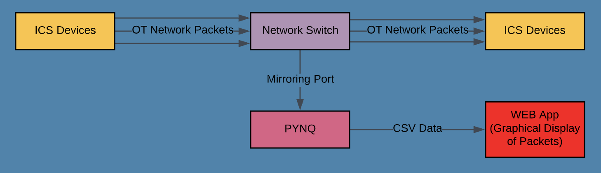

# Repository for Group 2 CyberTap
CyberTap, the network tap of the future.  

# What is CyberTap?
CyberTap is a high throughput hardware network tap designed for industrial control systems closed off from the internet. Other network monitoring solutions are software based with overutilized CPUs which could theoretically result in packet loss. Packet loss is particularly undesirable in the context of the high data throughput involved in industrial control systems, especially as said systems directly rely on input data for operation. CyberTap will be able to collect Operational Technology (OT) network packets, parse and generate metadata for all relevant network protocols of a system, and store said metadata in persistent storage. The product will be implemented on a Field Programmable Gate Array (FPGA) to utilize their ability to quickly process large data loads. The final deliverable will contain the following: An emulated high-data-volume OT network using 2 Raspberry Pis and a network switch, an FPGA that sniffs, parses, and outputs the packet data coming from the SPAN port of the switch, and a web application for querying the CSV and displaying the metadata.

# Getting Started
In order to get CyberTap up and running, first configure a SPAN port on the desired network switch. This is the port that CyberTap will be connected to. Next, plug the PYNQ into a computer via microUSB-USB connection and plug in the power plug, and connect to the SPAN port via ethernet, and then switch on the power switch. After this, Go to your computer's network device settings and create a network adapter with a manually set IPv4 address set to that of the board (in our case, 192.168.137.15, with a subnet mask of 255.255.0.0). Then, navigate to the device's IP and port (default if unchanged on the board settings) in your web browser. You'll be greeted with a Jupyter notebook login screen. The default login information is username: Xilinx, password: Xilinx123. Next, in Jupyter notebook start a new console. In the console, navigate to the directory PYNQ/Jupyter_Notebooks and run the script main.sh. To then run the web application, follow the instructions in the software report of the wiki pages and run node server.js. Then you should navigate to localhost:8080/main.html in your browser. CyberTap should now be sniffing, parsing, storing, and displaying on the web app all packets going through the configured network switch.

# How It Works Diagram

# Who Are We? The History of CyberTap.
In the summer of 2019, Felipe Dale Figeman asked his employers at Cybereason if they had an idea for a year long project. Thus, CyberTap was born. The group formed and agreed to build a hardware based network tap.    
Felipe Dale Figeman. Email: fdale@bu.edu  
Felipe is a Computer Engineering major that has taken classes such as Embedded Systems, Cloud Computing, and Operating Systems. His role is focused on packet sniffing and being able to connect the Pis and FPGA so the FPGA may receive the packets to parse.    
Alex Fatyga. Email: afatyga@bu.edu  
Alex is a Computer Engineering major that has taken classes such as Operating Systems, Smart and Connected Systems, and CS Software Engineering. Her role is focused on the front end and receiving packet information into the front end.  She will also be working on hosting of the web application from the PYNQ board.    
Evan Lang. Email: evanlang@bu.edu  
Evan is a Computer Engineering major that has taken classes such as Digital VLSI Design, Electronics and Computer Architecture. Evan created, generated, and tested the Microblaze processor used to operate the ethernet controller and run the server on the FPGA. He used Vivado SDK to create and test the echo server used as a template for the project. He will be taking the main role in packet parsing next semester.    
Noah Malhi. Email: malhin@bu.edu  
Noah is a Computer Engineering major that has taken classes such as Embedded Systems, Operating Systems, and High Performance Programming. Noah is focused on simulating the network activity with the Raspberry Pis and writing the packet information to SD and SSD. Noah has also assisted in the first semester’s efforts to sniffing the packets on the Nexys A7 from the network switch.    
Justin Morgan. Email: justinfm@bu.edu  
Justin is a Computer Engineering major that has taken classes such as Smart and Connected Systems and Operating Systems and has prior networking experience. Justin’s role is to work on the packet logic after the parsing of the protocols. He will deal with generation of metadata. Justin will also assist in writing from FPGA to the external SSD.

# GitHub Info
PYNQ_sniff holds all files that we run on the PYNQ and is the most up to date  
front_end holds server.js and main.html which is the web application. server.js reads in the csv file and uses socket io to send it over to main.html to be added to the table

# Remaining Work
After the work completed in the second semester, the group has proposed the following plan to complete the project:

Task 1. Prepare for Long Term Use.
After parsing a packet, the packet is written into a CSV file that the web application is able to read from. Currently, this file is only written to and only emptied on start up. Consequently, writing to the CSV will have to be modified. The CSV file will need to also be used for the data storage. The following milestones will complete the necessary steps to have a system prepared for long term use:
Milestone 1: Test to decide the period of time it takes for the CSV file to become half full.
Milestone 2: Modify writing to CSV to empty file after this period of time.

Task 2. Web Application Improvements.
The web application can be improved in various ways to allow the user a better viewing experience. These simple modifications will greatly increase the usability of the application.The first improvement would be to introduce auto refreshing into the web app. This would be done in the front end and is a relatively easy addition. The second improvement would be to have new packets show in the top of the table rather than at the bottom. This means that newer packets are at the top and older packets are at the bottom. This addition would also be relatively easy and would be done by modifying the front end. The following milestones will complete the necessary web application improvements:
Milestone 1: Auto refresh each second.
Milestone 2: Modify front end to add new packets to the top of the table.

Task 3. Hardware Packet Parsing.
Although software packet parsing was completed and had great performance, hardware packet parsing would be even greater. In terms of hardware parsing, Xilinx SDnet software was being procured from Boston University. This software would have enabled easy production of the parsing modules. These modules would then have been integrated into the python overlay of the PYNQ board and used as a replacement for the current software parsing system. This would significantly increase the maximum bandwidth the Cybertap would be able to handle. The following milestones will allow for the creation of a hardware parsing system:
Milestone 1: Create a hardware parsing module for one packet type in Xilinx SDnet.
Milestone 2: Integrate the parsing module into the PYNQ-Z1’s python overlay system.
Milestone 3: Create multiple parsing modules and a system for switching between the different modules for different packet types in the PYNQ-Z1.

Task 4. Simplifying Setup and Startup.
The current setup of the system would include plugging in the FPGA and downloading NodeJS, multiple other packages and the web application code from the group’s GitHub repo. Simple steps would greatly simplify this process and allow for a better ease of use. A batch file would be created that would set up the web application and install NodeJS as well as many npm packages. Another batch file would be created for web application startup and would include running the main javascript file. Then, the GitHub must be updated with a zip file of all necessary files and instructions in the readme for the user to follow. The following milestones will allow for a more simplified setup and startup:
Milestone 1: Complete a batch file for setup. 
Milestone 2: Complete a batch file for startup.
Milestone 3: Add instructions to GitHub.

